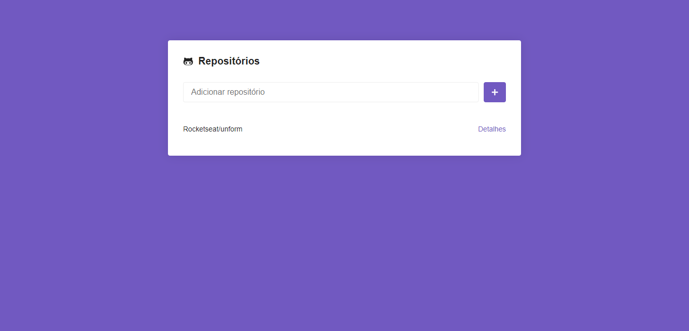
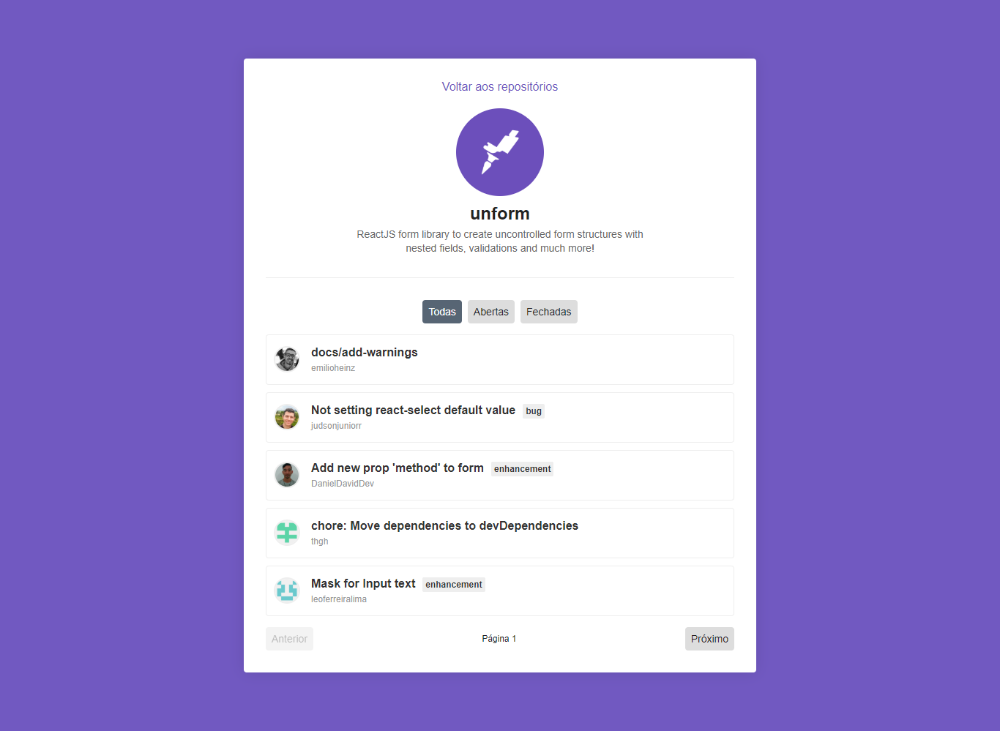

# Rocketseat Bootcamp Challenge - ReactJS Application

GitHub repositories

## Steps to Setup

1. Install dependencies

```bash
> yarn
```

2. Run app

```bash
> yarn start
```

Open <http://localhost:3000> to view it in the browser.




